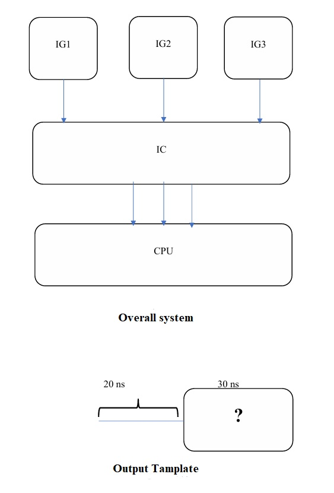
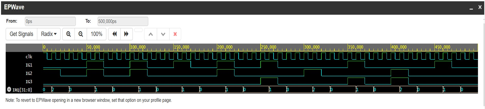

# ⚡ Lab 07 – Multi-Interrupt System Simulation in SystemC

This project simulates a **multi-interrupt environment** in SystemC where three independent interrupt generators (IG1, IG2, IG3) trigger the CPU via a centralized **Interrupt Controller (IC)**. Each generator randomly decides to fire or skip its interrupt based on a probabilistic model. The CPU prioritizes handling interrupts in a fixed order: IG1 > IG2 > IG3.

---

## 🎯 Objective

- Model and simulate multiple asynchronous interrupt sources
- Design an interrupt controller with **priority encoding**
- Enable a CPU to handle interrupts based on priority and ISR execution
- Generate and trace signals to `.vcd` file for debugging and visualization

---

## 🧩 System Overview

### 🔸 Interrupt Generators (IG1, IG2, IG3)
- Each IG randomly activates every cycle (50% chance)
- Output pattern:  
  - ON for `20ns`  
  - OFF for `30ns`  
  - OR skip entire cycle

### 🔸 Interrupt Controller (IC)
- Reads all three IG lines
- Outputs one interrupt code based on priority:  
  `1 = IG1`, `2 = IG2`, `3 = IG3`, `0 = none`

### 🔸 CPU
- Monitors `irq` signal
- Executes 30ns ISR for any active interrupt
- Default: performs normal operation every 10ns clock cycle

---

## 🖼️ Block Diagram

---

## ▶️ Sample Console Output

[IG1] Interrupt ON at 0 ns
[CPU] ISR IG1 at 10 ns
[IG1] Interrupt OFF at 20 ns
[IG3] Skipped at 50 ns
[CPU] ISR IG2 at 100 ns
[CPU] Normal Operation at 110 ns

---

## 📊 Waveform Visualization

Signals such as `IG1`, `IG2`, `IG3`, `IRQ`, and `clk` are traceable in the VCD file using **GTKWave**.

---

## 👨‍💻 Author

AliAkbar Mohsennejad  
SystemC Lab – K. N. Toosi University of Technology

---

## 🏷️ Tags

`systemc` `interrupt` `multi-interrupt` `cpu` `hardware-simulation` `vcd-tracing` `priority-handling` `kntu` `digital-design`
